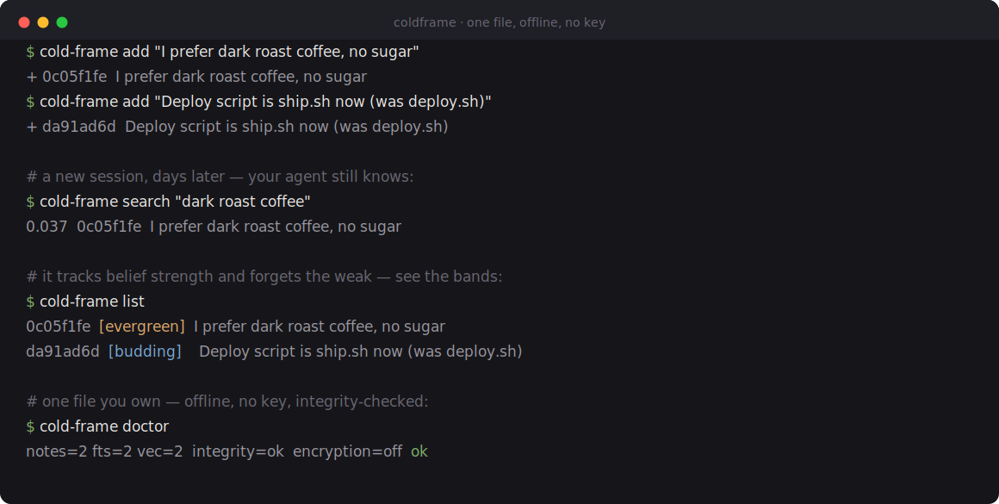

<p align="center">
  
</p>

<h1 align="center">coldframe</h1>

<p align="center">
  <b>Local-first memory for your AI agent.</b><br>
  One SQLite file you own — offline, no API key. Plugs straight into Claude Code.
</p>

<p align="center">
  <a href="https://github.com/coldzero94/cold-frame/actions/workflows/ci.yml"></a>
  
  
  
  
</p>

<p align="center">
  
</p>
<p align="center">
  <sub><i>Your memory as a banked fire — warmth is belief, the cold is forgetting. Pinned facts sit under glass; the weak gutter out.</i></sub>
</p>

---

Your agent forgets everything between sessions. **coldframe** gives it a memory that lives in one
local file (`~/.cold-frame/memory.db`) — with full-text + vector search, version history, automatic
forgetting, and the ability to rewind *what was true when*. No server, no account, no key.

## Quickstart

**In Claude Code** — one install, then it remembers automatically:

```bash
claude plugin marketplace add coldzero94/cold-frame
claude plugin install coldframe
```

Recall is injected at the start of every session; durable facts you state are captured as you work
(using the Claude you already pay for — no extra key or cost). Nothing to configure.

**On the command line** — offline, instant:

<p align="center">
  
</p>

```bash
cold-frame add "I prefer dark roast coffee."
cold-frame search "dark roast coffee"
cold-frame list            # each memory with its strength band
cold-frame doctor          # health: counts, integrity, embedder
```

*(Install: `brew install coldzero94/coldframe/cold-frame` (Apple Silicon macOS + Linux x86_64), or
download the self-contained binary for your platform from the
[latest release](https://github.com/coldzero94/cold-frame/releases/latest) — CLI + MCP in one file,
no Python needed. The optional `[local-llm]` (semantic recall) extra isn't in the binary; install
from source for that — see [`examples/`](examples/).)*

## Why coldframe

- 🗃️ **One file you own** — everything is `~/.cold-frame/memory.db`. Copy it to back up, delete it
  to forget. No server, no account.
- 🔌 **Offline by default** — `add` → `search` works with zero keys, zero network.
- 🤖 **Automatic in Claude Code** — recalls what matters, captures durable facts as you work — and
  the engine keeps it lean instead of hoarding everything.
- ⏪ **Rewindable belief** — facts are corrected and superseded, never silently overwritten. Ask
  *"what did I believe back in March?"* and get the answer as of that date.
- 🧭 **Conflict resolution** — supersession is always deterministic (code decides by `valid_at`, never
  the LLM). *Detecting* that two facts contradict needs a model: the `cold-frame worker` (and
  `COLD_FRAME_LLM=claude`, using your Claude session — no API key) turn it on; the zero-key offline
  default still does exact/near-duplicate merging and honors explicit `correct`/`supersede`.

## How the memory works

- **Recall** — a SessionStart hook injects your strongest durable memories; a UserPromptSubmit hook
  adds ones relevant to the current prompt (gated so it adds signal, not noise).
- **Capture** — Claude itself extracts durable facts and calls `add_memory` during your session (a
  bundled skill), with a keyless deterministic backstop so nothing is missed; dedup merges them.
- **Stays lean** — every ~20 facts a consolidation pass decays, rolls up, and archives the weakest
  (per-scope caps), so the active set never grows without bound. Forgetting *archives* — nothing is
  truly deleted, and obvious secrets (API keys, tokens, private keys) are blocked before they ever
  touch disk. PII redaction (email/phone/card/ssn) is available **opt-in** (`add --redact-pii`, or
  `Memory(pii_redact=…)`) — off by default so a personal store keeps your own contact facts. For
  at-rest protection, the DB is a single local file — put it on an OS-encrypted disk (FileVault /
  LUKS), which covers the stolen-laptop threat without a second key to manage.
- **Per-project + global** — facts are tagged by git project; clear personal facts go to a global
  tier recalled everywhere.
- **Semantic recall (opt-in)** — the zero-config default recall is lexical (offline `HashEmbedder`,
  no download). For semantic recall, install from source with the `[local-llm]` extra and set
  `COLD_FRAME_EMBEDDER=local` (a small local `bge-small` model, downloaded once — nothing leaves the
  machine). After switching on an existing DB, run `cold-frame reembed` to re-index.

It's a standard stdio MCP server, so it works with any MCP client — not just Claude Code.

## Use it as a library

```python
from datetime import UTC, datetime
from cold_frame import Memory, Scope

mem = Memory()                                   # ~/.cold-frame/memory.db, offline
me = Scope(user_id="coby")
mem.add("I switched jobs to Anthropic in 2026.", scope=me)
print(mem.search("where do I work?", scope=me).hits[0].note.content)

past = mem.search("where do I work?", scope=me, as_of=datetime(2026, 3, 1, tzinfo=UTC))  # rewind
```

See and edit your memory anytime: `cold-frame ui` — a local dashboard at `127.0.0.1:27182` where
you can browse facts and pin / correct / forget them (writes are CSRF-guarded and localhost-only).

## More

- **Install & distribution** — [`packaging/`](packaging/) (plugin, Homebrew, standalone binary)
- **Design & spec** — [`docs/`](docs/) (the spec, decisions, and the analysis of mem0 / Letta /
  Zep-Graphiti / Cognee / MemOS / A-MEM / LangMem that informed it)
- **Back up / move** — `cold-frame export backup.db` then `import` it elsewhere.

## Status

The engine, CLI, MCP server, Claude Code plugin, deterministic pre-disk secret-blocking +
grep-verified hard-purge, opt-in PII redaction, an admission confidence-gate + opt-in consent hold,
idempotent event-log replay import, and a local web UI are built and tested end-to-end on a fully
offline gate (`ruff` + `mypy --strict` + ~420 deterministic mock-LLM tests green on a 3.12/3.13 CI
matrix). The automatic
recall + capture loop is verified end-to-end against real Claude Code. Distributed as a self-contained
binary via Homebrew + GitHub Releases (not PyPI).

Apache-2.0.
